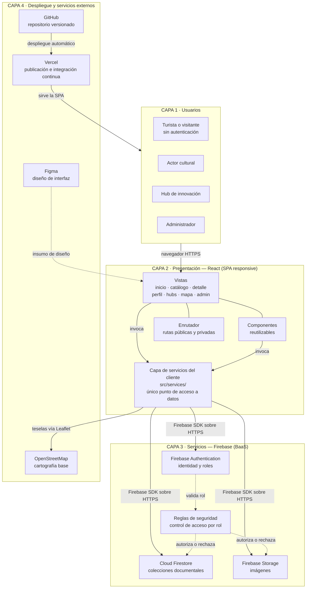

# Arquitectura de la solución

> **Historia de usuario:** HU-04 · Sprint 2
> **Objetivo específico:** 2 — Definir la arquitectura por capas del sistema.
> **Requisito asociado:** RNF-09 (mantenibilidad y evolucionabilidad).
> **Fuente:** Trabajo de grado, §6.4 *Arquitectura de la Solución*.

La solución adopta una arquitectura modular organizada en **cuatro capas**, siguiendo el
principio de separación de responsabilidades planteado por Pressman (2010) y Sommerville
(2011). Esta organización permite que cada capa evolucione de manera independiente y hace
posible incorporar más adelante funcionalidades avanzadas —analítica de datos, contenidos
inmersivos— sin rediseñar el sistema completo.

---

## 1. Diagrama de capas



## 2. Responsabilidad de cada capa

| Capa | Responsabilidad | Tecnología que la resuelve |
| --- | --- | --- |
| **1. Usuarios** | Agrupa los cuatro roles definidos y sus permisos. El visitante consulta sin registrarse; los demás operan sobre una sesión autenticada. | Navegador web sobre HTTPS. |
| **2. Presentación** | Aplicación de página única con diseño responsive, organizada en componentes que se corresponden con los módulos funcionales. Contiene vistas, componentes, enrutador y la capa de servicios del cliente. | **React** con enrutamiento del lado del cliente. **Leaflet** como componente de React para el mapa. |
| **3. Servicios** | Backend como servicio: gestiona identidad y roles, persiste la información, almacena imágenes y controla el acceso a cada colección según el rol del usuario autenticado. | **Firebase Authentication**, **Cloud Firestore**, **Firebase Storage** y sus **reglas de seguridad**. |
| **4. Despliegue y servicios externos** | Entorno de publicación con integración continua, repositorio versionado, cartografía base y herramienta de diseño. | **Vercel**, **GitHub**, **OpenStreetMap**, **Figma**. |

## 3. Regla de acceso a datos

> **La capa de presentación no accede a datos sin pasar por la capa de servicios.**

Esta regla —segundo criterio de aceptación de HU-04— es verificable de forma objetiva en
el código:

- **Ningún componente ni vista importa el SDK de Firebase directamente.** Los módulos
  `firebase/auth`, `firebase/firestore` y `firebase/storage` solo pueden importarse desde
  archivos bajo `src/services/`.
- Toda operación de lectura o escritura se expresa como una función del servicio
  correspondiente (`eventosService.listarAprobados()`, `authService.registrar()`), que
  devuelve objetos de dominio ya normalizados, no documentos crudos de Firestore.
- Las vistas y componentes consumen esos servicios mediante hooks o llamadas directas, y
  desconocen qué motor de persistencia hay detrás.

**Verificación:** el siguiente comando no debe devolver ninguna coincidencia.

```bash
grep -rE "from ['\"]firebase/" src --include=*.jsx --include=*.js -l | grep -v "^src/services/"
```

El beneficio práctico es que sustituir Firestore por otro motor, o añadir una capa de
caché, se resuelve dentro de `src/services/` sin tocar una sola vista.

## 4. Comunicación y seguridad

- La comunicación entre la capa de presentación y la capa de servicios se realiza mediante
  el **kit de desarrollo de Firebase sobre HTTPS**. No existe servidor propio ni API REST
  intermedia.
- El control de acceso vive en **dos capas simultáneas**: la interfaz oculta lo que el rol
  no puede usar, y las **reglas de seguridad de Firestore** rechazan la operación aunque
  se intente desde fuera de la interfaz. Una sin la otra no satisface RNF-08 (véase HU-11
  y HU-15).
- Las contraseñas nunca se almacenan en la base de datos del proyecto: la autenticación
  está delegada por completo en Firebase Authentication (RNF-05).
- El tratamiento de los datos personales se sujeta a la **Ley 1581 de 2012** y al Decreto
  1377 de 2013, conforme al marco normativo (RNF-06, HU-16).

## 5. Estructura de carpetas derivada

La arquitectura se materializa en la siguiente estructura, que se crea en HU-07 (Sprint 3):

```
src/
├── components/      # Componentes reutilizables sin lógica de datos
├── views/           # Una carpeta por vista del prototipo
├── services/        # ÚNICO punto de acceso a Firebase y a servicios externos
│   ├── firebase.js  # Inicialización del SDK
│   ├── authService.js
│   ├── eventosService.js
│   ├── actoresService.js
│   ├── hubsService.js
│   ├── categoriasService.js
│   └── moderacionService.js
├── hooks/           # Hooks compartidos (sesión, rol, carga)
├── utils/           # Utilidades puras: fechas, normalización de texto, validaciones
├── routes/          # Definición de rutas públicas y privadas
└── styles/          # Estilos globales y variables de la paleta
```

## 6. Decisiones de arquitectura y su justificación

| Decisión | Alternativa descartada | Razón |
| --- | --- | --- |
| Backend como servicio (Firebase) | Backend propio (Node + base de datos gestionada) | Equipo de dos integrantes con 12 horas semanales (R-03); un backend propio consumiría el presupuesto de tiempo de dos sprints completos. |
| Base de datos documental (Firestore) | Base de datos relacional | La información cultural es heterogénea y no se ajusta cómodamente a un esquema relacional rígido. |
| Leaflet + OpenStreetMap | Google Maps u otro servicio comercial | Evita el costo asociado a los servicios cartográficos comerciales y se ajusta a la restricción de recursos gratuitos (R-02, RNF-10). |
| SPA en React | Renderizado en servidor | Se despliega como sitio estático en el nivel gratuito de Vercel y no requiere servidor en ejecución. |

---

*Elaboración propia (2026).*
