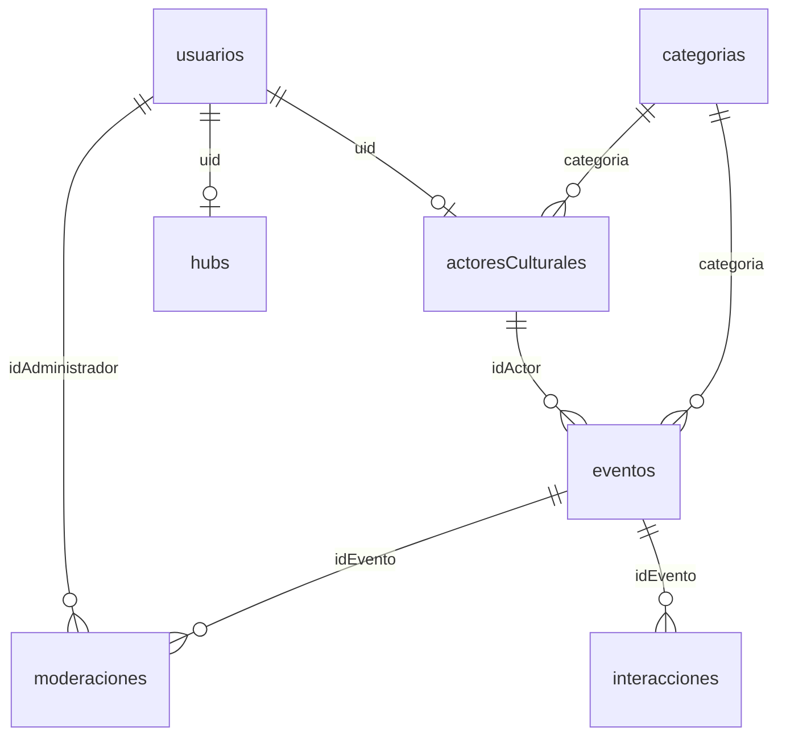

# Modelo de datos en Cloud Firestore

> **Historia de usuario:** HU-05 · Sprint 2
> **Objetivo específico:** 2 — Diseñar la estructura de colecciones y documentos.
> **Requisitos asociados:** RF-03 a RF-11.
> **Fuente:** Trabajo de grado, *Fase de diseño*, tabla 25.

Cloud Firestore es una base de datos documental organizada en colecciones. Esta elección
responde a la naturaleza heterogénea de la información cultural, que no se ajusta
cómodamente a un esquema relacional rígido, y a la necesidad de reducir el esfuerzo de
infraestructura en un proyecto con dos integrantes.

**Convenciones aplicadas en todo el modelo:**

- Las relaciones entre colecciones se resuelven **mediante identificadores de referencia**
  (el `id` del documento de destino guardado como `string`), nunca por anidamiento ni por
  duplicación de la entidad completa.
- Los identificadores de documento se generan automáticamente por Firestore, salvo en
  `usuarios`, donde el identificador del documento **es** el `uid` de Firebase
  Authentication. Esto permite resolver el rol del usuario en una sola lectura.
- Las fechas se almacenan como `timestamp` de Firestore, nunca como texto, para que las
  consultas por rango funcionen correctamente.
- Un campo marcado como **obligatorio** no puede guardarse vacío ni nulo; las reglas de
  seguridad lo verifican en escritura.

---

## 1. Resumen de colecciones

| Colección | Contenido | Escribe | Lee |
| --- | --- | --- | --- |
| `usuarios` | Cuenta de acceso y rol de cada persona registrada. | El propio usuario (su documento) y el administrador. | El propio usuario y el administrador. |
| `actoresCulturales` | Perfil público del portador de la manifestación cultural. | El actor propietario. | Público (solo `estado == "aprobado"`). |
| `hubs` | Perfil público del hub de innovación y sus líneas de trabajo. | El responsable del hub. | Público (solo `estado == "aprobado"`). |
| `eventos` | Evento o experiencia cultural publicada, con su ubicación. | El actor autor y el administrador. | Público (solo `estadoPublicacion == "aprobado"`). |
| `categorias` | Catálogo de categorías culturales. | Solo el administrador. | Público. |
| `moderaciones` | Registro de las decisiones de moderación sobre cada publicación. | Solo el administrador. | El administrador y el actor afectado. |
| `interacciones` | Registro anonimizado de consultas y contactos. | Cualquiera (solo creación). | Solo el administrador. |

## 2. Diagrama de relaciones



---

## 3. `usuarios`

Identificador del documento: **`uid` de Firebase Authentication**.

| Campo | Tipo | Obligatorio | Descripción |
| --- | --- | --- | --- |
| `uid` | `string` | Sí | Identificador de Firebase Authentication. Coincide con el id del documento. |
| `nombre` | `string` | Sí | Nombre para mostrar. |
| `correo` | `string` | Sí | Correo de la cuenta. Único, validado por Authentication. |
| `rol` | `string` | Sí | Uno de: `actor`, `hub`, `administrador`. El rol `turista` no crea documento. |
| `fechaRegistro` | `timestamp` | Sí | Momento de creación de la cuenta. |
| `consentimientoDatos` | `map` | Sí | `{ aceptado: boolean, fecha: timestamp, version: string }` — evidencia de HU-16. |
| `estado` | `string` | Sí | `activo` o `inactivo`. Gestionado por el administrador (RF-14). |

> La contraseña **no aparece** en el modelo: la gestiona Firebase Authentication (RNF-05).

## 4. `actoresCulturales`

Identificador del documento: **`uid` de Firebase Authentication**, igual que en `usuarios`.

Un actor tiene un perfil y solo uno, y esta es la única forma de que las reglas de seguridad
puedan garantizarlo: desde una regla no se puede consultar «¿existe ya otro documento con
este `uid`?», solo comprobar la existencia de una ruta concreta. El razonamiento completo,
incluida la comprobación de qué abre publicar un `uid` (nada), está en
[17-perfil-de-actor.md §2](17-perfil-de-actor.md).

| Campo | Tipo | Obligatorio | Descripción |
| --- | --- | --- | --- |
| `idActor` | `string` | Sí | Identificador del documento. Coincide con `uid`. |
| `uid` | `string` | Sí | **Referencia** a `usuarios`. Determina quién puede editar el perfil. |
| `nombre` | `string` | Sí | Nombre del actor o colectivo. Máximo 80 caracteres. |
| `manifestacion` | `string` | Sí | Manifestación o práctica cultural que representa. Máximo 120 caracteres. |
| `descripcion` | `string` | Sí | Máximo 1.000 caracteres, comprobado en el formulario y en las reglas (HU-18). |
| `categoria` | `string` | Sí | **Referencia** a `categorias.idCategoria`. |
| `contacto` | `map` | Sí | `{ telefono: string\|null, correo: string\|null, whatsapp: string\|null }` — canales autorizados por el actor (RF-12). |
| `redes` | `map` | No | Enlaces a redes sociales. Admite valor nulo. |
| `imagenUrl` | `string` | No | URL en Firebase Storage. Nulo cuando no hay imagen: se muestra una predeterminada (HU-19). |
| `estado` | `string` | Sí | `pendiente`, `aprobado` o `inactivo`. |

## 5. `hubs`

| Campo | Tipo | Obligatorio | Descripción |
| --- | --- | --- | --- |
| `idHub` | `string` | Sí | Identificador del documento. |
| `uid` | `string` | Sí | **Referencia** a `usuarios`. |
| `nombre` | `string` | Sí | Nombre del hub. |
| `descripcion` | `string` | Sí | Descripción del espacio. |
| `lineasDeTrabajo` | `array<string>` | Sí | Al menos un elemento. |
| `direccion` | `string` | Sí | Dirección física. |
| `coordenadas` | `geopoint` | Sí | Latitud y longitud, necesarias para el mapa (HU-20). |
| `contacto` | `map` | Sí | Canales de contacto del hub. |
| `estado` | `string` | Sí | `pendiente`, `aprobado` o `inactivo`. |

## 6. `eventos`

Colección central del sistema.

| Campo | Tipo | Obligatorio | Descripción |
| --- | --- | --- | --- |
| `idEvento` | `string` | Sí | Identificador del documento. |
| `idActor` | `string` | Sí | **Referencia** a `actoresCulturales`. Determina la propiedad de la publicación (RF-06). |
| `titulo` | `string` | Sí | Título de la experiencia. |
| `descripcion` | `string` | Sí | Descripción completa. |
| `tituloNormalizado` | `string` | Sí | Título en minúsculas y sin tildes. Soporta la búsqueda insensible a mayúsculas y acentos de HU-27. |
| `categoria` | `string` | Sí | **Referencia** a `categorias.idCategoria`. |
| `fechaInicio` | `timestamp` | Sí | Debe ser anterior o igual a `fechaFin` (validado en HU-21). |
| `fechaFin` | `timestamp` | Sí | — |
| `lugar` | `string` | Sí | Nombre del lugar en texto. |
| `coordenadas` | `geopoint` | No | Nulo si el actor no seleccionó punto; en ese caso el evento **no aparece en el mapa** y se advierte al guardar (HU-22). |
| `imagenUrl` | `string` | No | URL en Firebase Storage. |
| `estadoPublicacion` | `string` | Sí | `pendiente`, `aprobado` o `devuelto`. Nace siempre en `pendiente` (HU-21). |
| `fechaCreacion` | `timestamp` | Sí | Asignada por el servidor, no por el cliente. |
| `contadorConsultas` | `number` | Sí | Inicia en `0`. Alimenta los indicadores de RF-15. |

## 7. `categorias`

| Campo | Tipo | Obligatorio | Descripción |
| --- | --- | --- | --- |
| `idCategoria` | `string` | Sí | Identificador del documento. |
| `nombre` | `string` | Sí | Nombre visible en los filtros. |
| `descripcion` | `string` | No | Texto orientador. |
| `activa` | `boolean` | Sí | Si se ofrece en los formularios y en los filtros. Añadido en HU-17. |

> Una categoría **no se elimina nunca**: se desactiva con `activa: false`. Las reglas no
> pueden contar los eventos que la usan —no hay consulta a otra colección desde una regla—,
> así que negar el borrado siempre es la única garantía real de que ninguna publicación se
> quede sin clasificación. El razonamiento completo está en
> [16 · categorías](16-categorias.md) §2.

## 8. `moderaciones`

Registro inmutable: los documentos se crean, nunca se editan ni se eliminan.

| Campo | Tipo | Obligatorio | Descripción |
| --- | --- | --- | --- |
| `idModeracion` | `string` | Sí | Identificador del documento. |
| `idEvento` | `string` | Sí | **Referencia** a `eventos`. |
| `idAdministrador` | `string` | Sí | **Referencia** a `usuarios`. |
| `decision` | `string` | Sí | `aprobado` o `devuelto`. |
| `observaciones` | `string` | Condicional | **Obligatorio cuando `decision == "devuelto"`** (HU-24); nulo cuando es aprobación. |
| `fecha` | `timestamp` | Sí | Asignada por el servidor. |

## 9. `interacciones`

Base de los indicadores de uso. **No contiene ningún dato personal identificable del
visitante** (RNF-06, HU-34).

| Campo | Tipo | Obligatorio | Descripción |
| --- | --- | --- | --- |
| `idInteraccion` | `string` | Sí | Identificador del documento. |
| `idEvento` | `string` | Sí | **Referencia** a `eventos`. |
| `tipo` | `string` | Sí | `consulta` o `contacto`. |
| `fecha` | `timestamp` | Sí | Asignada por el servidor. |

## 10. Índices compuestos requeridos

El cuarto criterio de aceptación de HU-05 exige consultar eventos filtrando por categoría
y por rango de fechas simultáneamente. Firestore no resuelve esa combinación con índices
simples: hay que declararla en `firestore.indexes.json`.

| Colección | Campos del índice | Consulta que habilita | Historia |
| --- | --- | --- | --- |
| `eventos` | `estadoPublicacion` ASC, `categoria` ASC, `fechaInicio` ASC | Catálogo público filtrado por categoría y rango de fechas. | HU-26 |
| `eventos` | `estadoPublicacion` ASC, `fechaInicio` ASC | Catálogo público ordenado por fecha. | HU-25 |
| `eventos` | `idActor` ASC, `fechaCreacion` DESC | Publicaciones propias del actor cultural. | HU-23 |
| `eventos` | `estadoPublicacion` ASC, `fechaCreacion` ASC | Cola de moderación ordenada por antigüedad. | HU-24 |
| `eventos` | `estadoPublicacion` ASC, `contadorConsultas` DESC | Publicaciones más consultadas. | HU-34 |
| `moderaciones` | `idEvento` ASC, `fecha` DESC | Historial de moderación de una publicación. | HU-24 |

```json
{
  "indexes": [
    {
      "collectionGroup": "eventos",
      "queryScope": "COLLECTION",
      "fields": [
        { "fieldPath": "estadoPublicacion", "order": "ASCENDING" },
        { "fieldPath": "categoria", "order": "ASCENDING" },
        { "fieldPath": "fechaInicio", "order": "ASCENDING" }
      ]
    },
    {
      "collectionGroup": "eventos",
      "queryScope": "COLLECTION",
      "fields": [
        { "fieldPath": "estadoPublicacion", "order": "ASCENDING" },
        { "fieldPath": "fechaInicio", "order": "ASCENDING" }
      ]
    },
    {
      "collectionGroup": "eventos",
      "queryScope": "COLLECTION",
      "fields": [
        { "fieldPath": "idActor", "order": "ASCENDING" },
        { "fieldPath": "fechaCreacion", "order": "DESCENDING" }
      ]
    },
    {
      "collectionGroup": "eventos",
      "queryScope": "COLLECTION",
      "fields": [
        { "fieldPath": "estadoPublicacion", "order": "ASCENDING" },
        { "fieldPath": "fechaCreacion", "order": "ASCENDING" }
      ]
    },
    {
      "collectionGroup": "eventos",
      "queryScope": "COLLECTION",
      "fields": [
        { "fieldPath": "estadoPublicacion", "order": "ASCENDING" },
        { "fieldPath": "contadorConsultas", "order": "DESCENDING" }
      ]
    },
    {
      "collectionGroup": "moderaciones",
      "queryScope": "COLLECTION",
      "fields": [
        { "fieldPath": "idEvento", "order": "ASCENDING" },
        { "fieldPath": "fecha", "order": "DESCENDING" }
      ]
    }
  ],
  "fieldOverrides": []
}
```

## 11. Nota sobre la búsqueda por palabra clave

Firestore no ofrece búsqueda de texto completo. Dado el alcance del prototipo, HU-27
resuelve la búsqueda **sobre el conjunto ya cargado en el cliente**, comparando el término
—normalizado a minúsculas y sin tildes— contra `tituloNormalizado` y `descripcion`. Por eso
`tituloNormalizado` se persiste en el documento en lugar de calcularse en cada consulta.

---

*Elaboración propia (2026).*
