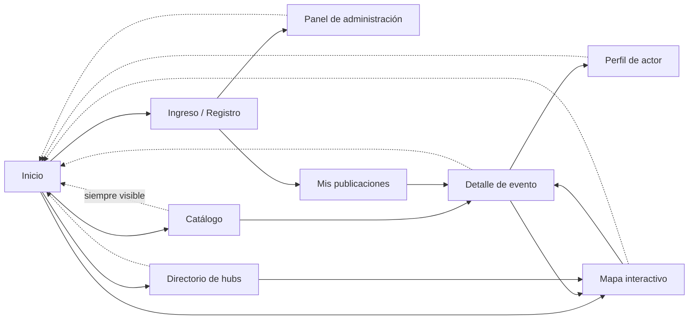

# Prototipo de interfaz — especificación para Figma

> **Historia de usuario:** HU-06 · Sprint 2
> **Objetivo específico:** 2 — Validar la estructura de navegación antes de escribir código.
> **Requisitos asociados:** RNF-01, RNF-03, RNF-07.

> ⚠️ **Estado: parcial.** Este documento es la **especificación** del prototipo: mapa de
> navegación, inventario de vistas, paleta con contrastes verificados y rejilla responsive.
> El **archivo de Figma** todavía no existe y es lo único que falta para cerrar HU-06.
>
> 🖥️ **Maqueta navegable:** [`prototipo/index.html`](prototipo/index.html) — las 9 vistas
> construidas y conmutables en los tres anchos de RNF-03. Ábrela en el navegador; sirve
> para validar la navegación con el asesor y para calcar el diseño en Figma.

El prototipo aprobado es condición de la **Definición de Listo** para toda historia con
componente visual, es decir, para todas las historias de los sprints 3 a 7.

---

## 1. Mapa de navegación

Desde cualquier vista interna existe siempre un camino visible de regreso al inicio
(criterio de aceptación de HU-09).

## 2. Inventario de vistas

Siete vistas obligatorias según el primer criterio de aceptación de HU-06, más dos de
soporte.

| # | Vista | Acceso | Contenido mínimo | Historias |
| --- | --- | --- | --- | --- |
| V-1 | **Inicio** | Público | Propósito de la plataforma y los **cuatro accesos principales**: eventos, actores culturales, hubs y mapa. | HU-09, HU-10 |
| V-2 | **Catálogo** | Público | Rejilla de tarjetas con imagen, título, categoría, fecha y lugar. Barra de filtros (categoría, rango de fechas) y campo de búsqueda. Paginación o carga progresiva a partir de 12 elementos. Estado vacío con mensaje orientador. | HU-25, HU-26, HU-27 |
| V-3 | **Detalle de evento** | Público | Imagen, título, descripción, fechas, lugar, categoría, acceso al perfil del actor, mapa reducido con la ubicación y botón de contacto. | HU-28, HU-29 |
| V-4 | **Perfil de actor cultural** | Público (lectura) / privado (edición) | Imagen, nombre, manifestación, descripción, categoría, canales de contacto y listado de sus publicaciones aprobadas. | HU-18, HU-19 |
| V-5 | **Directorio de hubs** | Público | Listado de hubs aprobados con nombre, descripción, líneas de trabajo, dirección y contacto. | HU-20 |
| V-6 | **Mapa interactivo** | Público | Mapa a pantalla útil con un marcador por publicación aprobada georreferenciada, filtro de categoría y ficha emergente al seleccionar un marcador. | HU-30, HU-33 |
| V-7 | **Panel de administración** | Rol administrador | Cola de moderación ordenada por antigüedad, gestión de categorías y panel de indicadores. | HU-17, HU-24, HU-34 |
| V-8 | Ingreso y registro | Público | Formularios de acceso, registro con casilla de consentimiento y enlace a la política, y recuperación de contraseña. | HU-12, HU-13, HU-14, HU-16 |
| V-9 | Mis publicaciones | Rol actor cultural | Publicaciones propias con su estado, formulario de publicación con selector de punto en el mapa, y acciones de editar y eliminar. | HU-21, HU-22, HU-23 |

Cada vista debe diseñarse en **tres anchos**: 360, 768 y 1366 píxeles (RNF-03).

## 3. Paleta de color

Contrastes calculados según la fórmula de luminancia relativa de la WCAG 2.1. **Todos los
pares de uso previsto superan la relación mínima de 4,5 : 1** exigida por el tercer
criterio de aceptación de HU-06 y por HU-32.

| Token | Valor | Uso | Contraste sobre blanco | Contraste sobre arena |
| --- | --- | --- | --- | --- |
| `azul-profundo` | `#0B3C5D` | Encabezados, barra de navegación, texto sobre fondos claros. | **11,55 : 1** ✅ | **10,44 : 1** ✅ |
| `turquesa-oscuro` | `#0A5F5E` | Color de acción principal: botones, enlaces, foco. | **7,47 : 1** ✅ | **6,75 : 1** ✅ |
| `turquesa` | `#0E7C7B` | Acentos y fondos de estado. Para **texto**, usar la variante oscura. | 5,01 : 1 ✅ | 4,53 : 1 ⚠️ límite |
| `terracota` | `#B04A2F` | Estados de error y de publicación devuelta. | **5,43 : 1** ✅ | **4,91 : 1** ✅ |
| `ocre` | `#8A5A17` | Estado «pendiente de aprobación». | **5,91 : 1** ✅ | **5,34 : 1** ✅ |
| `gris-texto` | `#3A3F45` | Texto de párrafo. | **10,62 : 1** ✅ | **9,60 : 1** ✅ |
| `negro-texto` | `#14181C` | Títulos. | **17,84 : 1** ✅ | **16,13 : 1** ✅ |
| `arena` | `#F7F3EC` | Fondo de página. | — | — |
| `blanco` | `#FFFFFF` | Fondo de tarjetas y formularios. | — | — |
| `gris-borde` | `#D5CFC4` | Bordes y separadores (elemento no textual, umbral 3 : 1 sobre azul: **7,45 : 1** ✅). | — | — |

> El color nunca es el único portador de información: cada estado de publicación lleva
> además una etiqueta de texto (`Pendiente`, `Aprobado`, `Devuelto`).

## 4. Rejilla y puntos de corte

| Ancho | Rejilla | Menú | Tarjetas del catálogo |
| --- | --- | --- | --- |
| 360 px (móvil) | 4 columnas, margen 16 px | Compacto (hamburguesa) | 1 por fila |
| 768 px (tableta) | 8 columnas, margen 24 px | Compacto | 2 por fila |
| 1366 px (escritorio) | 12 columnas, margen 32 px | Horizontal completo | 3 o 4 por fila |

- Punto de corte del menú compacto: **768 px** (HU-10).
- Área mínima de toque de todo elemento interactivo en móvil: **44 × 44 px** (HU-10).
- Ninguna vista debe presentar desbordamiento horizontal a 360 px (HU-33).
- En móvil, las tablas del panel de administración se reorganizan como tarjetas apiladas.
- El mapa ocupa una altura útil que permita su manipulación y **no debe capturar el
  desplazamiento vertical de la página** (HU-30).

## 5. Requisitos de accesibilidad del diseño

Condiciones que el archivo de Figma debe reflejar para no arrastrar deuda a HU-32:

- Toda imagen de contenido tiene previsto su **texto alternativo** descriptivo.
- El **foco de teclado** es visualmente identificable: contorno de 2 px en
  `turquesa-oscuro` con separación de 2 px.
- El orden de tabulación sigue el orden de lectura; los formularios se pueden completar
  solo con teclado.
- Los mensajes de error se asocian visual y programáticamente al campo que los origina, y
  **no borran lo ya escrito** (HU-31).
- Tamaño base de texto: 16 px; ningún texto de contenido por debajo de 14 px.

## 6. Maqueta navegable

[`prototipo/index.html`](prototipo/index.html) es un solo archivo autónomo, sin
dependencias ni servidor: se abre haciendo doble clic. Contiene las nueve vistas de la
sección 2 con contenido cultural real de Santa Marta, no texto de relleno.

Cómo usarla:

- **Rail izquierdo:** cambia de vista. Cada entrada muestra su código y las historias que
  dependen de ella.
- **Selector 360 / 768 / 1366:** redimensiona el lienzo al ancho exacto de RNF-03. La
  adaptación es real —está resuelta con *container queries* sobre el lienzo—, así que lo
  que se ve es el comportamiento que tendrá el componente en React, no una simulación.
- **Anotaciones:** superpone la referencia de historia sobre cada elemento que la implementa.
- **Panel inferior:** qué revisar en la vista activa.

### Verificación automatizada ejecutada sobre la maqueta

Recorriendo las 9 vistas en los 3 anchos:

| Comprobación | Resultado |
| --- | --- |
| Desbordamiento horizontal (RNF-03, HU-33) | **0 px** en las 27 combinaciones |
| Área de toque mínima 44 × 44 px en 360 px (HU-10) | **0 elementos** por debajo del umbral |
| Menú compacto por debajo de 768 px (HU-10) | correcto en el punto exacto |
| Tabla del panel como tarjetas apiladas en móvil (HU-33) | correcta |
| Contrastes de la paleta (HU-06, HU-32) | todos ≥ 4,5 : 1, sección 3 |

Tres defectos reales aparecieron durante esa verificación y quedaron corregidos: el par de
campos *inicio / fin* desbordaba 10 px a 360 px, los chips de filtro y la paginación no
alcanzaban los 44 px de alto en móvil, y el punto de corte de 768 px no disparaba por 2 px
a causa del borde del contenedor. Son exactamente los hallazgos que HU-06 debe anticipar
antes de que lleguen al código.

## 7. Qué falta para cerrar HU-06

| # | Tarea | Estado |
| --- | --- | --- |
| 1 | Especificar navegación, vistas, paleta y rejilla. | ✅ este documento |
| 2 | Construir las 9 vistas navegables en los 3 anchos. | ✅ `prototipo/index.html` |
| 3 | Crear el archivo de Figma y trasladar las vistas. | ⬜ |
| 4 | Aplicar la paleta de la sección 3 como estilos de color de Figma. | ⬜ |
| 5 | Presentar el prototipo en la Sprint Review y registrar la retroalimentación del asesor. | ⬜ |
| 6 | Añadir el enlace del archivo de Figma en este documento y en el issue HU-06. | ⬜ |

**Enlace al archivo de Figma:** *(pendiente)*

---

*Elaboración propia (2026).*
