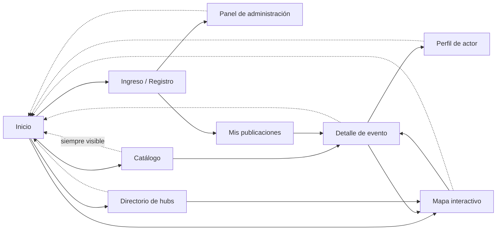

# Prototipo de interfaz — especificación para Figma

> **Historia de usuario:** HU-06 · Sprint 2
> **Objetivo específico:** 2 — Validar la estructura de navegación antes de escribir código.
> **Requisitos asociados:** RNF-01, RNF-03, RNF-07.

> Este documento es la **especificación** del prototipo: mapa de navegación,
> inventario de vistas, paleta con contrastes verificados y rejilla responsive.
> Lo construido a partir de ella está en dos sitios:
>
> 🎨 **Prototipo en Figma:** https://www.figma.com/proto/wAfJjgLhVl2owhFtxZ2PjN/Hub-Cultural-Santa-Marta-%E2%80%94-Prototipo?node-id=17-10047&starting-point-node-id=17%3A9189&scaling=min-zoom&content-scaling=fixed&t=pbQnxU0nW6OzSUZt-1 — 27 pantallas navegables, generadas con
> [`../figma-plugin/`](../figma-plugin/).
>
> 🖥️ **Maqueta HTML:** [`prototipo/index.html`](prototipo/index.html) — las mismas
> 9 vistas conmutables entre los tres anchos de RNF-03, sin salir del navegador.

El prototipo aprobado es condición de la **Definición de Listo** para toda historia con
componente visual, es decir, para todas las historias de los sprints 3 a 7.

---

## 1. Mapa de navegación

Desde cualquier vista interna existe siempre un camino visible de regreso al inicio
(criterio de aceptación de HU-09).

## 2. Inventario de vistas

Siete vistas obligatorias según el primer criterio de aceptación de HU-06, más dos de
soporte.

| # | Vista | Acceso | Contenido mínimo | Historias |
| --- | --- | --- | --- | --- |
| V-1 | **Inicio** | Público | Propósito de la plataforma y los **cuatro accesos principales**: eventos, actores culturales, hubs y mapa. | HU-09, HU-10 |
| V-2 | **Catálogo** | Público | Rejilla de tarjetas con imagen, título, categoría, fecha y lugar. Barra de filtros (categoría, rango de fechas) y campo de búsqueda. Paginación o carga progresiva a partir de 12 elementos. Estado vacío con mensaje orientador. | HU-25, HU-26, HU-27 |
| V-3 | **Detalle de evento** | Público | Imagen, título, descripción, fechas, lugar, categoría, acceso al perfil del actor, mapa reducido con la ubicación y botón de contacto. | HU-28, HU-29 |
| V-4 | **Perfil de actor cultural** | Público (lectura) / privado (edición) | Imagen, nombre, manifestación, descripción, categoría, canales de contacto y listado de sus publicaciones aprobadas. | HU-18, HU-19 |
| V-5 | **Directorio de hubs** | Público | Listado de hubs aprobados con nombre, descripción, líneas de trabajo, dirección y contacto. | HU-20 |
| V-6 | **Mapa interactivo** | Público | Mapa a pantalla útil con un marcador por publicación aprobada georreferenciada, filtro de categoría y ficha emergente al seleccionar un marcador. | HU-30, HU-33 |
| V-7 | **Panel de administración** | Rol administrador | Cola de moderación ordenada por antigüedad, gestión de categorías y panel de indicadores. | HU-17, HU-24, HU-34 |
| V-8 | Ingreso y registro | Público | Formularios de acceso, registro con casilla de consentimiento y enlace a la política, y recuperación de contraseña. | HU-12, HU-13, HU-14, HU-16 |
| V-9 | Mis publicaciones | Rol actor cultural | Publicaciones propias con su estado, formulario de publicación con selector de punto en el mapa, y acciones de editar y eliminar. | HU-21, HU-22, HU-23 |

Cada vista debe diseñarse en **tres anchos**: 360, 768 y 1366 píxeles (RNF-03).

## 3. Paleta de color

Contrastes calculados según la fórmula de luminancia relativa de la WCAG 2.1. **Todos los
pares de uso previsto superan la relación mínima de 4,5 : 1** exigida por el tercer
criterio de aceptación de HU-06 y por HU-32.

| Token | Valor | Uso | Contraste sobre blanco | Contraste sobre arena |
| --- | --- | --- | --- | --- |
| `azul-profundo` | `#0B3C5D` | Encabezados, barra de navegación, texto sobre fondos claros. | **11,55 : 1** ✅ | **10,44 : 1** ✅ |
| `turquesa-oscuro` | `#0A5F5E` | Color de acción principal: botones, enlaces, foco. | **7,47 : 1** ✅ | **6,75 : 1** ✅ |
| `turquesa` | `#0E7C7B` | Acentos y fondos de estado. Para **texto**, usar la variante oscura. | 5,01 : 1 ✅ | 4,53 : 1 ⚠️ límite |
| `terracota` | `#B04A2F` | Estados de error y de publicación devuelta. | **5,43 : 1** ✅ | **4,91 : 1** ✅ |
| `ocre` | `#8A5A17` | Estado «pendiente de aprobación». | **5,91 : 1** ✅ | **5,34 : 1** ✅ |
| `gris-texto` | `#3A3F45` | Texto de párrafo. | **10,62 : 1** ✅ | **9,60 : 1** ✅ |
| `negro-texto` | `#14181C` | Títulos. | **17,84 : 1** ✅ | **16,13 : 1** ✅ |
| `arena` | `#F7F3EC` | Fondo de página. | — | — |
| `blanco` | `#FFFFFF` | Fondo de tarjetas y formularios. | — | — |
| `gris-borde` | `#D5CFC4` | Bordes y separadores (elemento no textual, umbral 3 : 1 sobre azul: **7,45 : 1** ✅). | — | — |

> El color nunca es el único portador de información: cada estado de publicación lleva
> además una etiqueta de texto (`Pendiente`, `Aprobado`, `Devuelto`).

## 4. Rejilla y puntos de corte

| Ancho | Rejilla | Menú | Tarjetas del catálogo |
| --- | --- | --- | --- |
| 360 px (móvil) | 4 columnas, margen 16 px | Compacto (hamburguesa) | 1 por fila |
| 768 px (tableta) | 8 columnas, margen 24 px | Compacto | 2 por fila |
| 1366 px (escritorio) | 12 columnas, margen 32 px | Horizontal completo | 3 o 4 por fila |

- Separación entre tarjetas: **16 px** a 360, **18 px** a 768, **20 px** a 1366, y la
  misma medida **entre filas que entre columnas**. Dos tarjetas apiladas necesitan el
  mismo aire que dos tarjetas contiguas; a 360 px, donde cada tarjeta ocupa su propia
  fila, esa separación es la única que hay.
- Punto de corte del menú compacto: **768 px** (HU-10).
- Área mínima de toque de todo elemento interactivo en móvil: **44 × 44 px** (HU-10).
- Ninguna vista debe presentar desbordamiento horizontal a 360 px (HU-33).
- En móvil, las tablas del panel de administración se reorganizan como tarjetas apiladas.
- El mapa ocupa una altura útil que permita su manipulación y **no debe capturar el
  desplazamiento vertical de la página** (HU-30).

## 4 bis. Marca institucional y fondo

**Logotipo del Tecnológico de Antioquia**, arriba a la izquierda de la cabecera, en las
nueve vistas y en los tres anchos. Va sobre una **placa blanca**: la marca es verde
oscuro y la cabecera es `azul-profundo`, así que sobre el fondo directo quedaría muy por
debajo del 4,5 : 1 de la sección 3. Alturas: 20 px a 360, 26 a 768 y 30 a 1366.

**Fondo alusivo a la ciudad**, por debajo de todo el contenido y por debajo de la
cabecera, al **8 % de opacidad**. Es la silueta de la Sierra Nevada cayendo sobre el
Caribe —el perfil que tiene Santa Marta desde la bahía— dibujada con formas vectoriales.
Se genera, no se descarga: una fotografía exigiría resolver su licencia antes de que el
prototipo pueda publicarse, y el trabajo de grado es un documento público.

Si se prefiere una fotografía, el plugin acepta una desde su selector y la usa en lugar
de la ilustración, al 6 %. En ese caso hay que dejar constancia de la autoría y la
licencia de la imagen en este documento.

En ambos casos el fondo es **decorativo**: no porta información, y por eso no necesita
texto alternativo (WCAG 2.1, criterio 1.1.1).

## 5. Requisitos de accesibilidad del diseño

Condiciones que el archivo de Figma debe reflejar para no arrastrar deuda a HU-32:

- Toda imagen de contenido tiene previsto su **texto alternativo** descriptivo.
- El **foco de teclado** es visualmente identificable: contorno de 2 px en
  `turquesa-oscuro` con separación de 2 px.
- El orden de tabulación sigue el orden de lectura; los formularios se pueden completar
  solo con teclado.
- Los mensajes de error se asocian visual y programáticamente al campo que los origina, y
  **no borran lo ya escrito** (HU-31).
- Tamaño base de texto: 16 px; ningún texto de contenido por debajo de 14 px.

## 6. Maqueta navegable

[`prototipo/index.html`](prototipo/index.html) es un solo archivo autónomo, sin
dependencias ni servidor: se abre haciendo doble clic. Contiene las nueve vistas de la
sección 2 con contenido cultural real de Santa Marta, no texto de relleno.

Cómo usarla:

- **Rail izquierdo:** cambia de vista. Cada entrada muestra su código y las historias que
  dependen de ella.
- **Selector 360 / 768 / 1366:** redimensiona el lienzo al ancho exacto de RNF-03. La
  adaptación es real —está resuelta con *container queries* sobre el lienzo—, así que lo
  que se ve es el comportamiento que tendrá el componente en React, no una simulación.
- **Anotaciones:** superpone la referencia de historia sobre cada elemento que la implementa.
- **Panel inferior:** qué revisar en la vista activa.

### Verificación automatizada ejecutada sobre la maqueta

Recorriendo las 9 vistas en los 3 anchos:

| Comprobación | Resultado |
| --- | --- |
| Desbordamiento horizontal (RNF-03, HU-33) | **0 px** en las 27 combinaciones |
| Área de toque mínima 44 × 44 px en 360 px (HU-10) | **0 elementos** por debajo del umbral |
| Menú compacto por debajo de 768 px (HU-10) | correcto en el punto exacto |
| Tabla del panel como tarjetas apiladas en móvil (HU-33) | correcta |
| Contrastes de la paleta (HU-06, HU-32) | todos ≥ 4,5 : 1, sección 3 |

Tres defectos reales aparecieron durante esa verificación y quedaron corregidos: el par de
campos *inicio / fin* desbordaba 10 px a 360 px, los chips de filtro y la paginación no
alcanzaban los 44 px de alto en móvil, y el punto de corte de 768 px no disparaba por 2 px
a causa del borde del contenedor. Son exactamente los hallazgos que HU-06 debe anticipar
antes de que lleguen al código.

## 7. Qué falta para cerrar HU-06

| # | Tarea | Estado |
| --- | --- | --- |
| 1 | Especificar navegación, vistas, paleta y rejilla. | ✅ este documento |
| 2 | Construir las 9 vistas navegables en los 3 anchos. | ✅ `prototipo/index.html` |
| 3 | Crear el archivo de Figma y trasladar las vistas. | ✅ generado con [`../figma-plugin/`](../figma-plugin/) — 27 pantallas |
| 4 | Aplicar la paleta de la sección 3 como estilos de color de Figma. | ✅ 17 estilos de color y 12 de texto |
| 5 | Revisar a ojo lo generado: jerarquía tipográfica, alineación, legibilidad del panel en móvil. | ✅ revisado con el asesor el 21/08/2026 — ver más abajo |
| 6 | Presentar el prototipo en la Sprint Review y registrar la retroalimentación del asesor. | ⬜ |
| 7 | Añadir el enlace del archivo de Figma en este documento y en el issue HU-06. | ✅ |

**Prototipo navegable en Figma:** https://www.figma.com/proto/wAfJjgLhVl2owhFtxZ2PjN/Hub-Cultural-Santa-Marta-%E2%80%94-Prototipo?node-id=17-10047&starting-point-node-id=17%3A9189&scaling=min-zoom&content-scaling=fixed&t=pbQnxU0nW6OzSUZt-1

Se abre en modo presentación. El punto de entrada es la vista de Inicio; el botón
compacto del encabezado despliega el menú en los anchos de móvil.

### Hallazgo de la revisión del 21/08/2026

Al recorrer el prototipo con el asesor apareció que **al panel de administración (V-7) no
se llegaba**: estaba construido en los tres anchos, pero ningún elemento de ninguna otra
pantalla enlazaba con él. El mapa de la sección 1 sí lo preveía —`L --> A`, del ingreso al
panel—; lo que faltaba era el enlace en el archivo.

Dos motivos por los que no se detectó antes:

- **La maqueta HTML no tiene el problema y por eso lo tapó.** Su rail izquierdo lleva a
  cualquiera de las nueve vistas en un clic, así que V-7 siempre fue accesible ahí. En
  Figma no hay rail: solo existen los enlaces que se dibujen.
- **La auditoría del plugin no lo comprobaba.** Medía desbordamiento, áreas de toque,
  ajuste de línea, elementos aplastados y textos ilegibles: todas preguntas sobre cómo
  está construida una pantalla, ninguna sobre si se puede llegar a ella. Una vista sin un
  solo enlace de entrada las pasaba todas sin una queja.

Corregido en el *build 7*: V-8 incorpora un bloque de **acceso de demostración** con dos
entradas —«Entrar como actor cultural» → V-9 y «Entrar como administrador» → V-7—, porque
el prototipo no valida credenciales y esa validación es trabajo de HU-12 y HU-15. Y la
auditoría recorre ahora el grafo de enlaces desde Inicio y falla si alguna vista queda
fuera del recorrido; ejecutada contra el código anterior, señala las tres pantallas de V-7.

Es el tercer defecto de esta historia que solo aparece mirando el prototipo, después del
contenedor de filtros aplastado y del botón de menú sin interacción. La comprobación
automática se amplía cada vez, pero la revisión humana sigue encontrando lo que ninguna
regla anticipó.

### Segunda ronda de retroalimentación — 21/08/2026

Tres observaciones más del asesor, resueltas en el *build 8*.

**1 · Las tarjetas de evento se tocaban entre filas.** Había separación entre columnas
pero no entre filas, y a 360 px, donde cada tarjeta ocupa su propia fila, la lista entera
quedaba sin aire. Un contenedor con ajuste de línea tiene **dos** huecos —`itemSpacing`
dentro de la fila y `counterAxisSpacing` entre filas— y solo estaba fijado el primero.
Afectaba a **131 contenedores**: el catálogo, los cuatro accesos del inicio, las cifras
del panel, los metadatos de cada tarjeta y el pie.

Vuelve a ser un caso en el que la maqueta HTML estaba bien y el archivo de Figma no: la
propiedad `gap` de CSS fija los dos huecos a la vez, así que allí el defecto no podía
darse. La sección 4 recoge ahora la medida explícitamente, para que la especificación no
dependa de qué hace por defecto cada herramienta.

**2 · Falta el logotipo institucional.** Añadido arriba a la izquierda en las 27
pantallas y en el menú desplegable de móvil, con la placa blanca que describe la sección
4 bis.

**3 · Falta un fondo alusivo a la ciudad.** Añadido según la sección 4 bis.

La auditoría del plugin comprueba ahora las tres cosas: que ningún contenedor con ajuste
de línea deje las filas pegadas, que las 27 pantallas tengan fondo, y que el logotipo
esté cargado de verdad y no sea el marcador.

---

*Elaboración propia (2026).*
